<div align="center">

# 🌿 Glow — Skincare Commerce App

### 🚀 Kotlin Multiplatform • Production Backend • Cross-Platform (Android · iOS · Desktop)

> Full-stack KMP application handling real-world backend constraints (cold start, dynamic
> environments, resilient networking)

[]()
[]()
[]()
[]()
[]()
[]()
[]()
[]()
[]()

</div>

---

## 📱 Preview

| SignUp                                     | Home Tab                                 | Cart Tab                                 |
|--------------------------------------------|------------------------------------------|------------------------------------------|
| 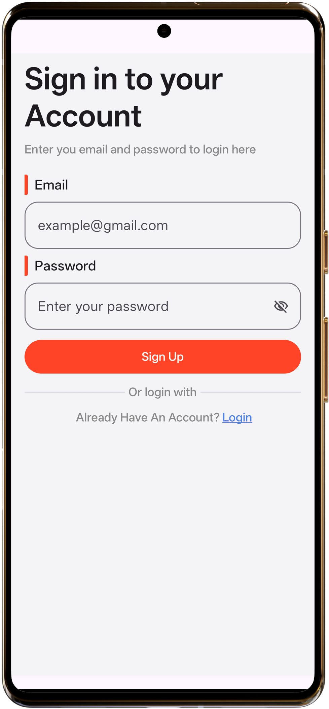 | 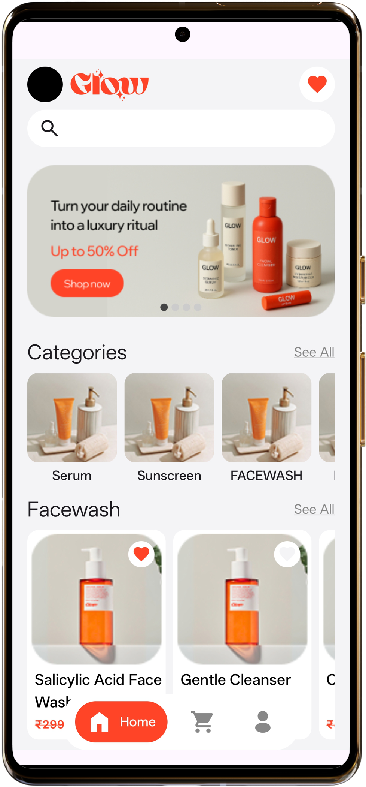 | 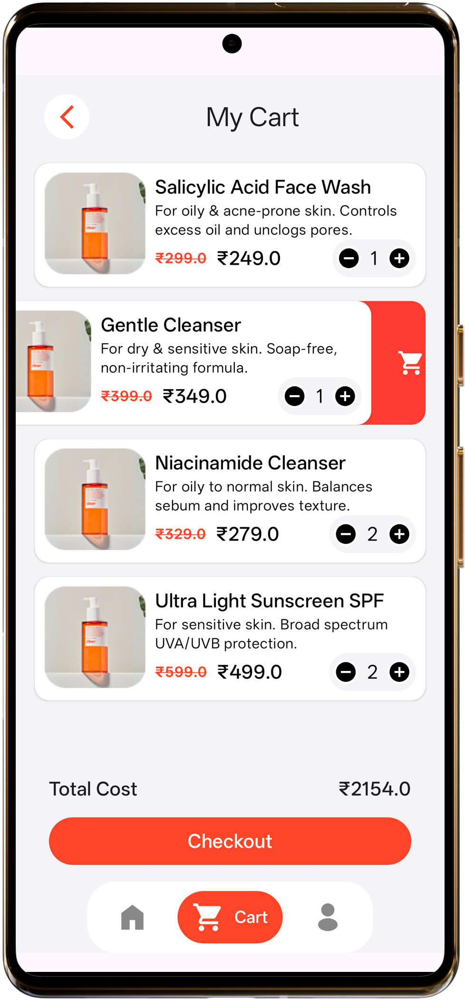 |

| Profile Tab                                 | Checkout                                     | See All                                      |
|---------------------------------------------|----------------------------------------------|----------------------------------------------|
| 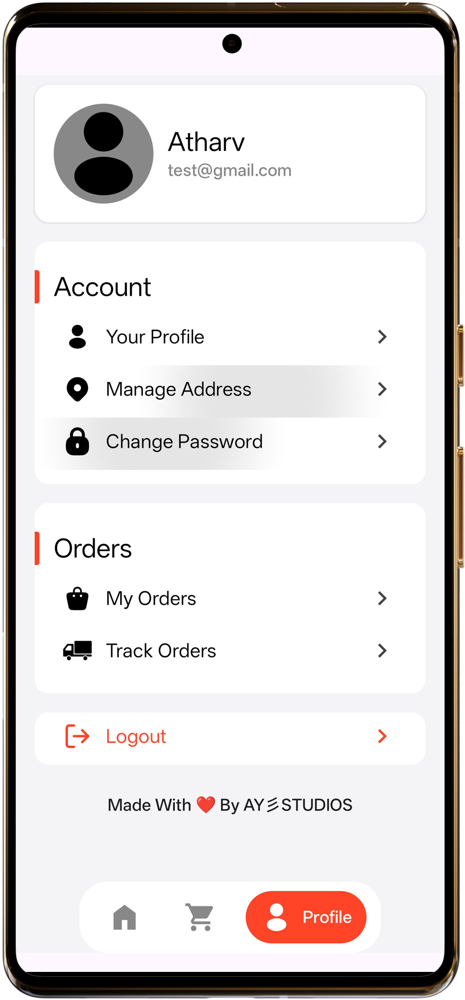 | 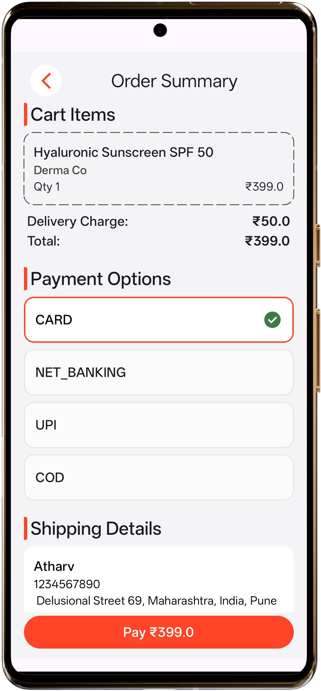 | 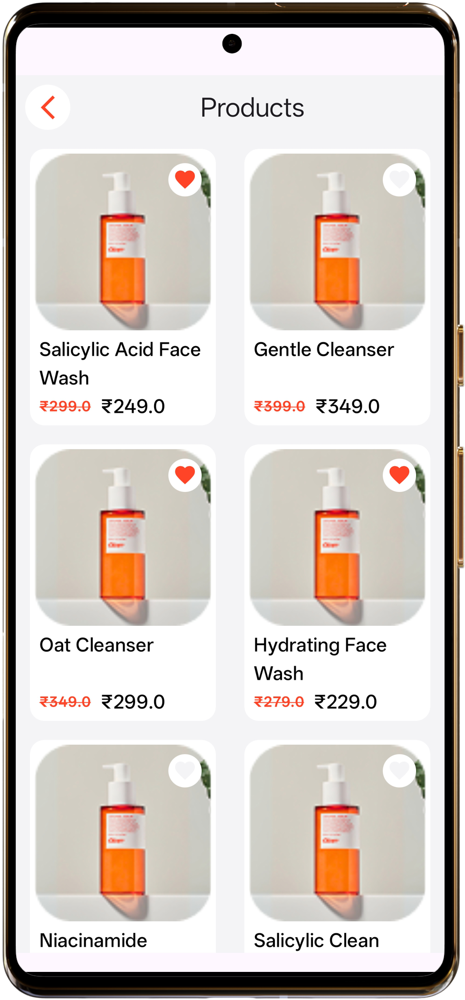 |
|                                             |                                              |                                              |

| Home Tab 2                                | Favourites                                     | Search                                     |
|-------------------------------------------|------------------------------------------------|--------------------------------------------|
| 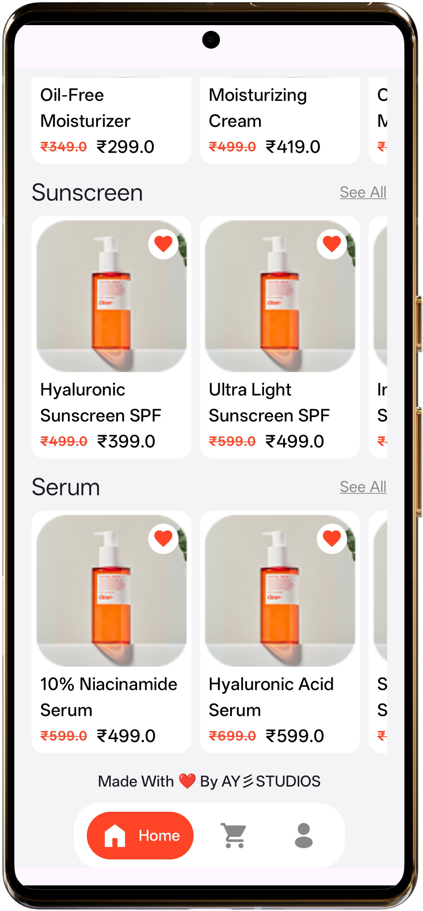 | 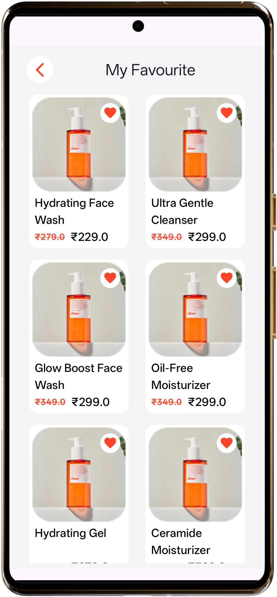 | 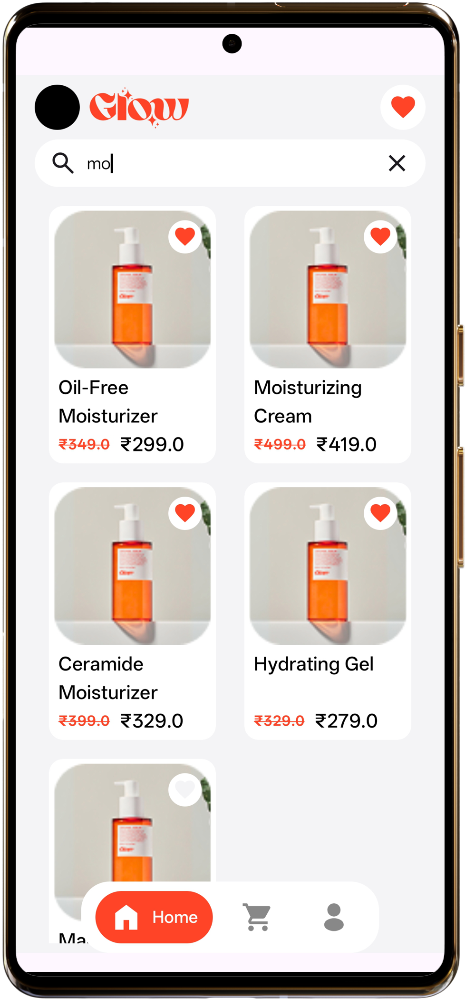 |

| Details                                     | Walking Server                             | Order Placing                               |
|---------------------------------------------|--------------------------------------------|---------------------------------------------|
| 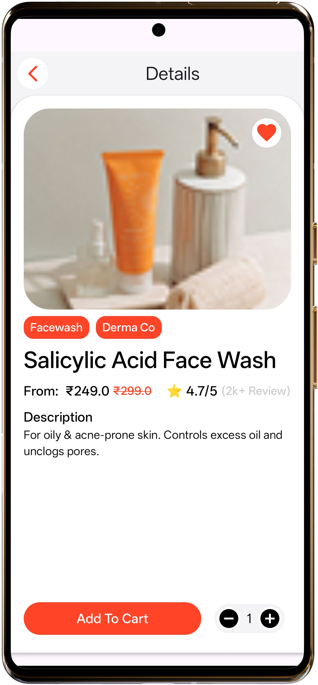 | 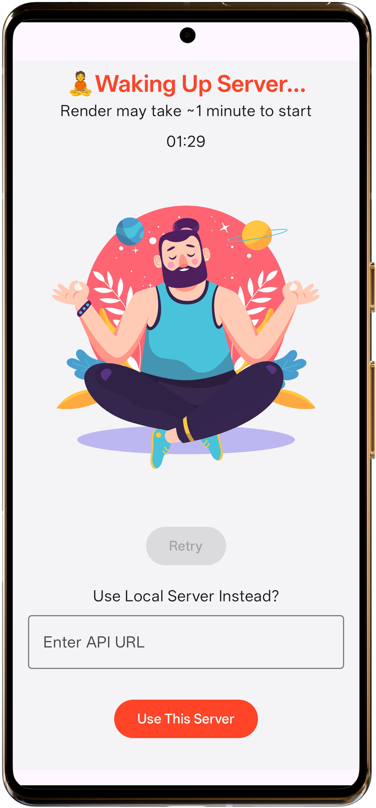 | 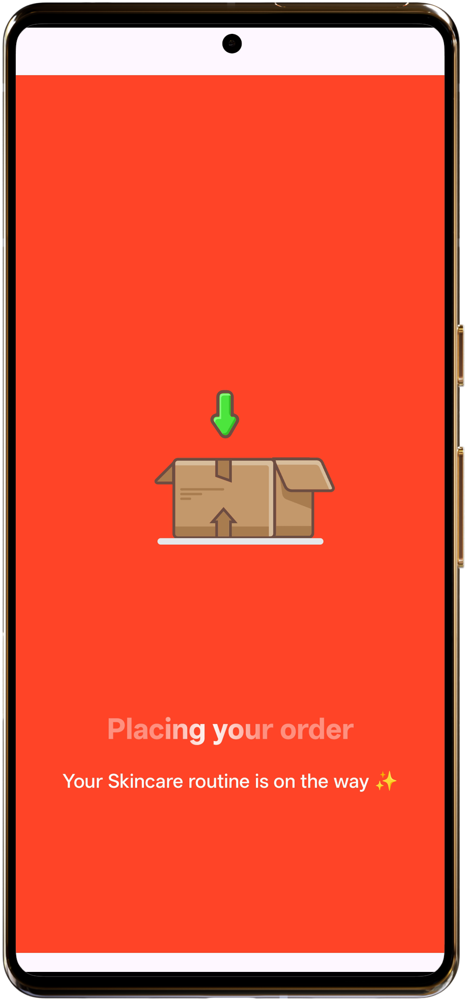 |

| Payment Processing                             | Edit Profile                                     | Track Orders Details                      |
|------------------------------------------------|--------------------------------------------------|-------------------------------------------|
| 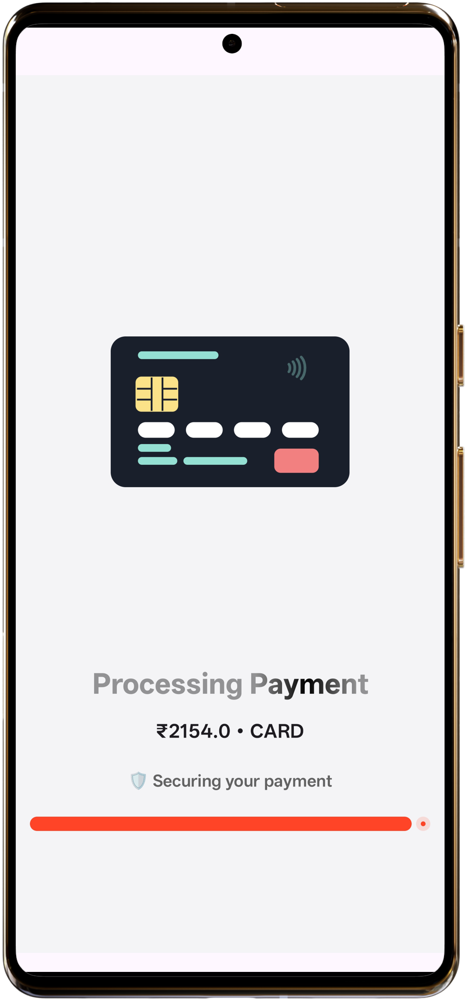 | 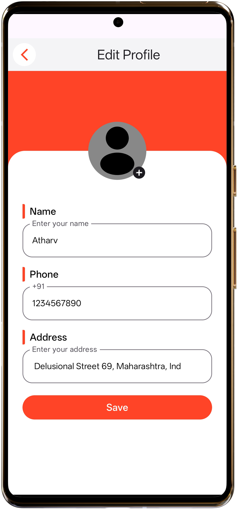 | 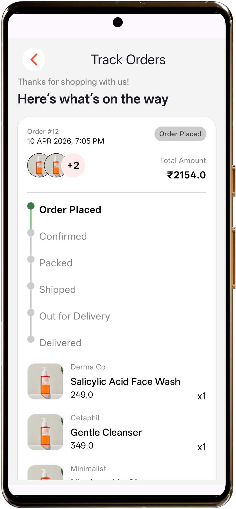 |

| Track Orders                               | Payment Processing                             |
|--------------------------------------------|------------------------------------------------|
| 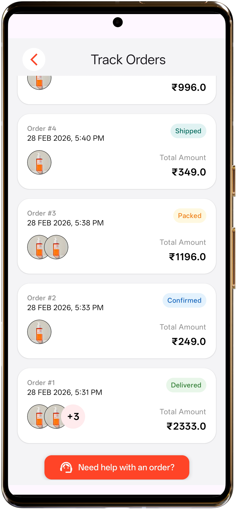 |  |

---

## 🎥 Demo

<!-- Add GIF / video -->

---

## 🧠 Architecture

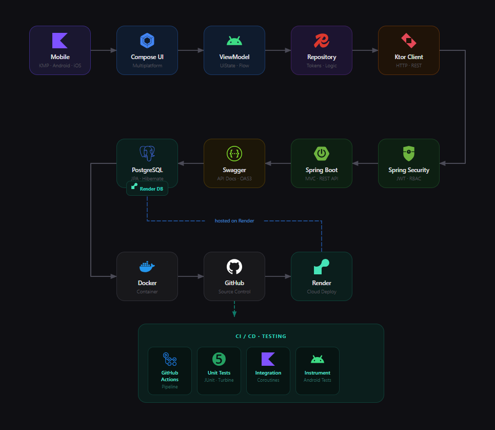
---

## ⚡ Highlights

| Feature           | Description                                     |
|-------------------|-------------------------------------------------|
| 📱 KMP            | Shared business logic (Android · iOS · Desktop) |
| 🎨 Compose        | Cross-platform UI (Compose Multiplatform)       |
| 🔄 Dynamic API    | Render ↔ Local switch (no restart)              |
| 🌍 Environment    | Runtime base URL switching                      |
| ⏳ Cold Start UX   | Countdown · Retry · Fallback                    |
| 🔐 Auth           | JWT (Access + Refresh flow)                     |
| 🔁 Token Handling | Auto refresh + secure persistence               |
| 🧠 State          | Loading → Success → Error (UiState)             |
| 🌐 Networking     | Ktor + Safe API handling (ApiResult)            |
| 📦 Architecture   | Clean (MVVM + Repository pattern)               |
| 🪢 Endpoints      | 30+ integrated APIs                             |
| 🧪 Testing        | KMP Unit (ViewModel + Repository)               |
| ⚙️ Config         | BuildKonfig + Multiplatform Settings            |
| 📡 Full Stack     | KMP + Spring Boot + PostgreSQL                  |

---

## 🛠️ Tech Stack

| Layer            | Tech                                                                          |
|------------------|-------------------------------------------------------------------------------|
| KMP              | [Kotlin Multiplatform](https://kotlinlang.org/docs/multiplatform.html)        |
| UI               | [Compose Multiplatform](https://www.jetbrains.com/lp/compose-multiplatform/)  |
| Network          | [Ktor](https://ktor.io/)                                                      |
| DI               | [Koin](https://insert-koin.io/)                                               |
| Storage          | [Multiplatform Settings](https://github.com/russhwolf/multiplatform-settings) |
| API Config       | [BuildKonfig](https://github.com/yshrsmz/BuildKonfig)                         |
| Logging          | [Kermit](https://github.com/touchlab/Kermit)                                  |
| Turbine Testing  | [Turbine](https://github.com/cashapp/turbine)                                 |
| Mockkery Testing | [Mokkery](https://github.com/lupuuss/Mokkery)                                 |

---

## 🌐 Backend & API

<div align="center">

### 🔗 Live System

| Service         | Link                                                      |
|-----------------|-----------------------------------------------------------|
| 🌐 Backend      | https://glow-backend-1.onrender.com                       |
| 📄 Swagger Docs | https://glow-backend-1.onrender.com/swagger-ui/index.html |
| ⚡ Wake Endpoint | https://glow-backend-1.onrender.com/api/auth/test         |

</div>

⚠️ First request may take ~60 seconds (Render cold start)

---

## 🚀 Usage

### 🔹 Production (Render)

1. Open app
2. Wait ~60 sec OR hit `/api/auth/test`
3. Continue normally

---

### 🔹 Local (Recommended for Testing)

1. Connect **phone + laptop on same network**
   👉 Best: use **mobile hotspot**

2. Enter Yoir local IP in app:

```text
Eg- 192.168.57.3
```

3. App auto converts:

```text
http://192.168.57.3:8080/api
```

✔ No manual URL
✔ No restart required

---
> ⚠️ Note  
> Some parts of the project are not included in this repo.  
> Building APK from source may fail — use the provided **release APK** instead.
---

<div align="center">
<b>Made with ❤️ by AY彡STUDIOS</b>
</div>
